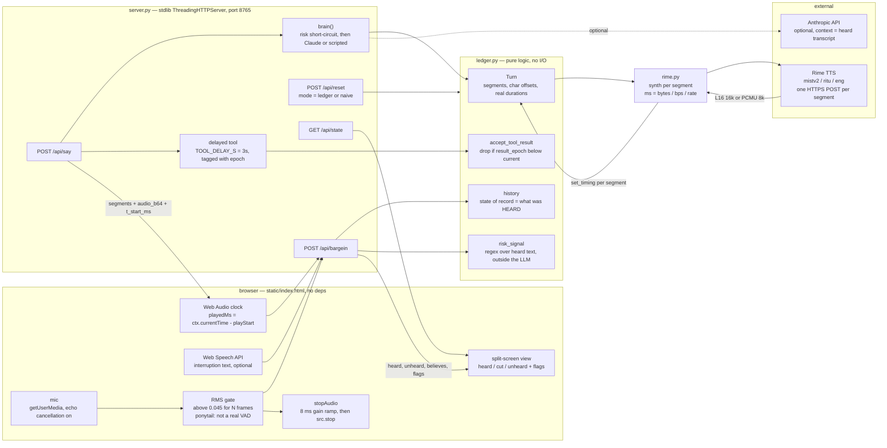
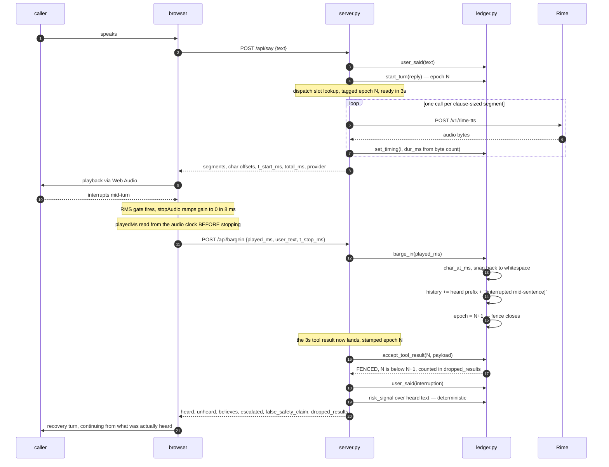
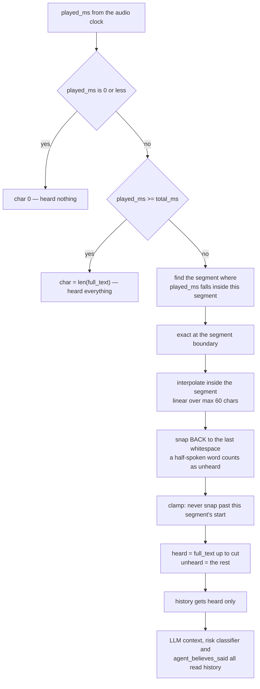
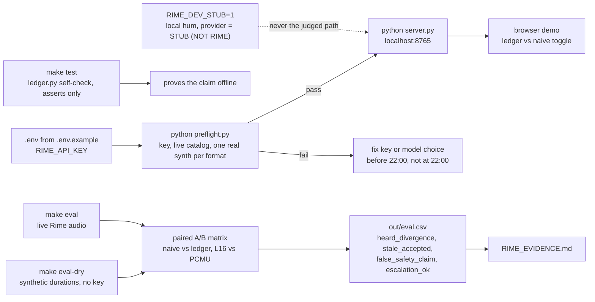

# Architecture — heard ledger

Four views: what the pieces are, what happens on a barge-in, how the heard/unheard
cut is decided, and how the thing is run and evaluated.

## 1. Context

## 2. Workflow — the stress case

The delayed tool and the barge-in are timed to collide. That collision is the test.

In `mode=naive` the same run appends the **full generated** text to history and has no
fence — that is the baseline `eval.py` measures against, not a strawman.

## 3. The heard/unheard cut

Every branch biases toward *unheard*. We never claim the caller heard more than they did.

## 4. Run and evaluate

