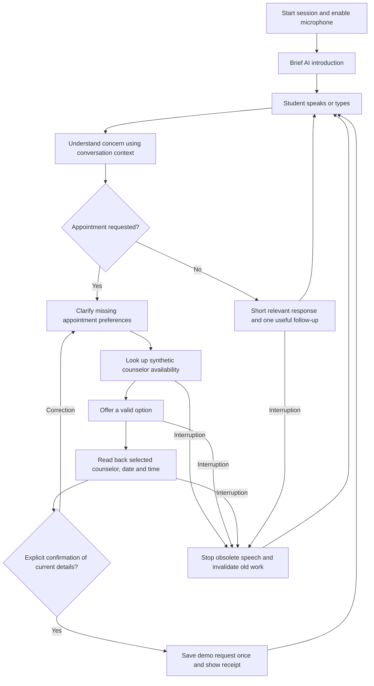

# Counselor assistant merge plan

Status: the conversation-first counselor now runs through `start-counselor.ps1` at `http://localhost:5173`; see [current setup and behavior](docs/COUNSELOR.md). It uses the configured Groq provider, supports live voice and typed conversation, and does not implement appointment booking. The broader appointment-request workflow below remains a proposal.

Verified against checkout `ec21a2e` on 2026-09-08.

## Product and scope

Assumption for review: "counselor assistant" means the existing student-support use case: an AI that talks with students, listens to their concerns, and helps them request a counselor appointment. It identifies itself as AI. The first merged version uses synthetic counselor availability and records demo requests locally; it does not claim a real appointment or human connection.

Use PickMate's application structure and controlled action workflow, with Heard Ledger's conversational behavior and conservative memory rules. Produce one primary runnable counselor application. Open conversation remains available throughout; students do not have to enter an appointment workflow to talk.

## Verified starting point

- Root `brain.py` already generates conversational replies through OpenAI Responses, using explicitly supplied conversation history. It is synchronous and does not stream, so its provider adapter needs adaptation for PickMate's asynchronous API.
- Root `ledger.py` separates generated speech from completed segments, but its timing comes from the old PCM browser player. Those timing values cannot be reused as LiveKit playback evidence.
- Root `server.py` has synthetic time lookup and a limited keyword-based risk response. It has no booking or counselor transfer integration. Its latched risk branch currently repeats one template on subsequent turns; porting it unchanged would preserve that limitation.
- PickMate has a FastAPI controller, authenticated sessions, SQLite transactions, worker generations, cancellation fences, LiveKit transport, Deepgram STT, and Rime streaming speech.
- PickMate's Groq interpreter only proposes inventory operations and explicitly prohibits spoken-text generation. Rebranding this prompt alone would not deliver natural conversation.
- PickMate's database, model types, confirmation parser, speech recognition vocabulary, fixtures, and React UI all contain inventory assumptions.
- PickMate's live UI needs to consider worker/provider connection state as well as browser room state.
- `pickmate/.env` is tracked. Exposed credentials must be rotated; removing a file from the latest tree does not remove earlier exposure.

Validation already available: PickMate's 70 backend tests, 6 frontend tests, and frontend production build passed during the preceding review. This review reran the root suite: 14 tests passed. PickMate's saved 30 stress trials are fixture trials with zero audio trials. None of these results establish a working merged app or measured live voice performance.

## Proposed user workflow

Pause, resume, repeat, cancel the pending request, and end-session controls remain available. Canceling a pending lookup does not erase an already committed receipt; the assistant reports the actual outcome if confirmation and cancellation race.

Examples:

- "I'm overwhelmed by exams" receives a relevant conversational acknowledgment, not a forced appointment question.
- "Can I speak with a counselor tomorrow morning?" starts a lookup only after any required details are clear.
- "Actually, evening only" during lookup or speech replaces the morning preference and invalidates its old result and readback.
- "Confirm the demo request with [counselor] tomorrow at six in the evening" authorizes only the currently offered option. An ambiguous "okay" prompts clarification.
- A detected immediate-danger concern interrupts ordinary scheduling and produces an appropriate support response. The demo explains actual connection availability without claiming a transfer. The existing keyword detector is not a clinical assessment system.

## Changes to make

| Area | Reuse | Required change |
| --- | --- | --- |
| Application structure | PickMate FastAPI, worker, React and dependency lock | Make a counselor app the canonical startup path; update package names, room/agent bindings, imports, browser session keys, scripts and documentation together. Keep the existing demos available during migration. |
| Conversation | Root `brain.py` behavior and history contract | Adapt to an async OpenAI provider using the existing configured model. Add natural conversation alongside fully validated counselor tool proposals. Cancel and fence obsolete model output. |
| Domain controller | PickMate task versions, input IDs, response epochs and transactional validation | Replace pick operations with conversation, preference updates, lookup, selection, confirmation and pending-request cancellation. Ordinary conversation must not require an active appointment task. |
| Domain models | PickMate session, speech and worker identity patterns | Replace Item/PickTask/quantity/SKU with counselor, time slot, appointment preference, request and confirmation models. Include explicit time zone and complete date/time in confirmation state. |
| Tools and fixtures | PickMate cancellable lookup and root appointment intent | Use a synthetic counselor/slot catalog. Only returned slot IDs can be selected. Resolve relative dates and ambiguous times before confirming. Replace inventory vocabulary and parsers, including STT keyterms. |
| Persistence | SQLite transactions and duplicate-input protection | Use a new counselor database rather than relabeling existing inventory data. Save confirmed demo requests once, with ownership and unique operation IDs. Recheck slot validity/capacity in the commit transaction. |
| Speech memory | Root ledger rules and PickMate response/worker identities | Add segment identities and completion events to the worker/API contract. Keep generated, estimated completed, interrupted and uncertain speech distinct. Feed only eligible completed segments into assistant history. If reliable segment correlation is unavailable, conservatively exclude the interrupted turn. |
| Voice output | LiveKit, Silero, Deepgram and Rime provider adapter | Retain Rime as the primary voice. Adapt sentence delivery and cancellation for natural conversational output, then listen for choppy delivery and false interruptions. Do not reuse the old browser PCM timing calculation. |
| User interface | PickMate voice controls, transcript, state revisions and recovery | Replace inventory and completed-pick panels with an optional appointment card and demo-request receipts. Use student/assistant transcript labels. Make typed fallback available during live connection failures and show actual provider readiness. |
| Support behavior | Root AI identity and honest capability boundaries | Preserve priority handling for relevant danger signals while avoiding a permanent repeated-template loop. Verify contextual handling with synthetic scenarios and document limitations. |
| Data handling | Session ownership | Choose explicit transcript retention/deletion behavior; do not copy permanent inventory-event logging into sensitive conversations without review. Use synthetic data for demos and evidence, and avoid recording raw audio by default. |
| Configuration | Existing provider preflight approach | Use OpenAI as the initial text provider, matching the user's earlier selection, with Rime for speech. Keep credentials server-side and make missing services explicit. Add Windows-compatible startup/test commands. |
| Evidence | Existing race, recovery, transcript and stress harness patterns | Replace inventory assertions with counselor scenarios; regenerate evidence after implementation rather than relabeling previous PickMate results. |

Natural language generation may express empathy and ask clarifying questions. Appointment facts and success announcements must be grounded in controller-owned tool results; the model cannot directly write a request. Confirmation requires current structured details, not merely an LLM-provided boolean.

The application owns the history sent to OpenAI. Do not automatically chain an abandoned full generated response into the next turn. OpenAI documents manually supplied conversation history and the application-executed function-call loop: [conversation state](https://developers.openai.com/api/docs/guides/conversation-state), [function calling](https://developers.openai.com/api/docs/guides/function-calling).

## Implementation order after review

1. Establish the counselor application structure and reproducible Windows commands, retain the verified baseline, and prevent new credential commits. Rotate exposed provider credentials before live use; coordinate any shared repository history rewrite separately.
2. Implement the counselor domain, synthetic lookup and atomic demo-request confirmation; port race, ownership, replay and restart tests first.
3. Integrate the OpenAI conversational adapter and application-owned history. Add the LiveKit speech-segment adapter, cancellation fencing and conservative interruption recovery.
4. Convert the React interface, worker vocabulary and readiness handling; enable typed input as an alternate input path through the same controller.
5. Run merged backend/frontend checks and browser workflows. Check normal conversation, corrections, confirmation, pause/end, duplicate inputs, worker replacement and provider failures.
6. Configure fresh credentials locally, verify the complete live path, record the frozen acceptance trials, and update the main README, demo script and Rime evidence from actual results.

## Acceptance checks for the merged app

- A greeting and a personal concern receive contextually relevant, short replies; no appointment is created merely because a student mentions morning or exams.
- The assistant remembers relevant user details and corrections across turns. Generated but interrupted appointment details never become established spoken history.
- An evening correction during a five-second cancellation-ignoring morning lookup produces no obsolete morning offer or request.
- Interruption remains possible during model generation, tool lookup, queued speech and active speech. Ended sessions and replaced workers reject old callbacks.
- An interrupted or outdated readback cannot authorize confirmation. Ambiguous time/date language asks for clarification. The current exact confirmation produces one demo receipt despite retries or reconnects.
- Simultaneous requests for a capacity-limited synthetic slot cannot overbook it. A committed request remains authoritative after restart.
- Loss of the voice worker is visible even if the browser remains in the LiveKit room. Typed input, recovery and truthful error reporting work without silently falling back to a scripted AI persona.
- Rime is audible in the complete judged path. Report response latency and real interruption-stop measurements separately from SDK estimates. Retain PickMate's proposed p95 <= 300 ms stop target across at least 30 valid spoken trials as a target until measured.
- Tests, build, browser results, live recordings and known limitations are reported separately. A provider preflight alone is not a completed live demo.

## Review decision

Confirm the student-facing counselor use case, PickMate-derived workflow, OpenAI conversation provider, and synthetic appointment-request scope before implementation. No application source files were changed for this proposal.
