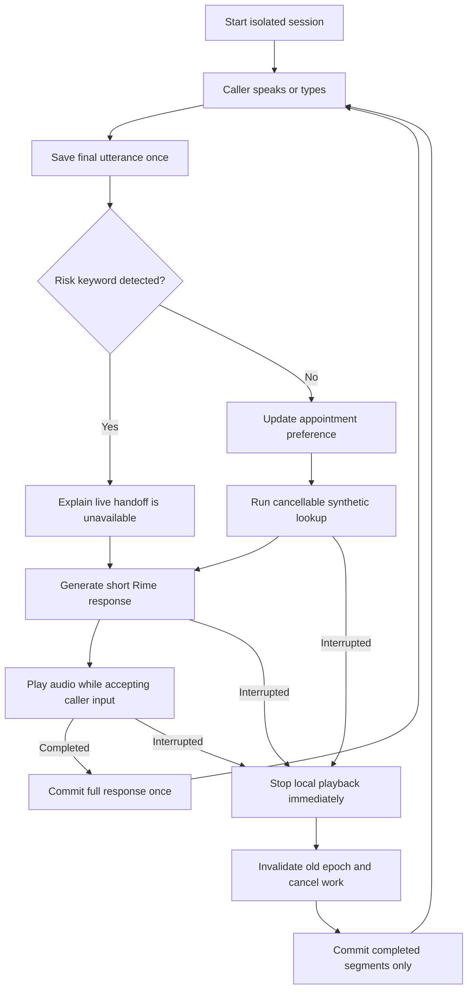

# Heard — AI support

The main app is now the **virtual counselor conversation experience**, using Groq for replies and LiveKit, Deepgram, and Rime for voice. Start it with `.\start-counselor.ps1 -Restart` and open **http://localhost:5173**. It supports natural conversation, a readable transcript, and typed input while voice is paused or unavailable. See [counselor setup and behavior](docs/COUNSELOR.md).

The documentation below describes the earlier root browser prototype.

## Earlier Heard Ledger prototype

A browser voice-triage **prototype** that keeps conversation history aligned with completed audio segments. When a caller interrupts, the application stops playback, invalidates old work, captures the correction, and responds to the updated request.

The target user is a student exploring support options. This is not therapy or a live support service. Appointments are synthetic; no booking, telephone transport, or counsellor transfer is implemented. The interface and risk response disclose those limits.

## The voice problem

Generated speech can run ahead of playback. If an interrupted response contains an appointment time or safety question, recording the whole response creates false conversation history. Heard Ledger commits completed segments only and leaves the interrupted segment unconfirmed. The caller may hear a brief repeat after an interruption.

This is conservative segment accounting based on client timing, **not proof of what reached a person's ear**. We do not infer word timing from character counts.

## Workflow and architecture



- `server.py`: standard-library HTTP server, per-session locks and opaque session identifiers. Lookup and synthesis run on worker threads outside request locks.
- `ledger.py`: segment accounting, history, and epoch fencing. `naive` mode deliberately commits the generated response after interruption; both browser modes still cancel obsolete work. The offline evaluator separately compares unfenced tool-result acceptance.
- `rime.py`: sequential per-segment synthesis. Cancellation stops subsequent calls; an already-running HTTP call may finish, but its audio is discarded.
- `static/app.js`: microphone gate, final speech recognition, serial request mutations, stale-response suppression, playback completion acknowledgements, and resource cleanup.
- No database: sessions are in memory. End-session removes them; inactive sessions are pruned when new sessions are created. Restarting the server clears them.

## Setup (Windows PowerShell)

Python 3.9+; standard library only. Natural conversation requires both OpenAI and Rime API keys. Add them to the ignored local `.env` file and restart the server.

```powershell
Copy-Item .env.example .env
# Edit .env locally and add OPENAI_API_KEY and RIME_API_KEY.
python preflight.py
python server.py
```

Open http://127.0.0.1:8765. Start a session, then select **Enable microphone**, or use the message field. Speech recognition depends on browser support; Chrome is recommended for manual verification. Use headphones to reduce self-interruption. End the session to release the microphone.

For local development without an API key:

```powershell
$env:RIME_DEV_STUB = '1'
$env:BRAIN_PROVIDER = 'scripted'
python server.py
```

The stub emits a hum, not intelligible speech, and displays `STUB (NOT RIME)`. Remove the variable before live testing: `Remove-Item Env:RIME_DEV_STUB`.

## Rime configuration

| Setting | Shipped value |
|---|---|
| Model | `mistv2` |
| Speaker | `ritu` |
| Language | `eng` |
| Endpoint | `https://users.rime.ai/v1/rime-tts` |
| Browser format | `audio/L16`, 16000 Hz, mono; decoded as little-endian PCM |
| Transport | HTTPS POST, one complete request per segment |
| Additional evaluation format | `audio/PCMU`, 8000 Hz; not a telephone connection |
| Delivery controls | Default speed; pronunciation dictionary empty |

These are configured values, not a fresh live compatibility claim. Run preflight with the exact demo credentials and inspect/listen to the resulting audio. The organizer's own preflight is also required. OpenAI now generates replies using committed history. The default model is `gpt-4.1-mini-2025-04-14`, configurable through `LLM_MODEL`. Explicit `BRAIN_PROVIDER=scripted` is available for offline tests; missing keys never silently select it.

Third-party services: OpenAI receives the committed text transcript for conversation, Rime provides spoken output, and browser speech recognition may use a browser-vendor service. Use synthetic scenarios only.

## Acceptance scenario

1. Ask for a morning appointment.
2. During the three-second lookup, interrupt and say or type: “Actually, evening only.”
3. Observe `tool_cancelled` for the original epoch and a new evening lookup.
4. The response offers six in the evening; it does not offer the obsolete morning result.
5. Repeat while audio is playing. Check completed segments, discarded speech, and the next response.
6. Let one response finish. Verify it enters history exactly once.

Change `TOOL_DELAY_S` in `.env` if needed. A request may be interrupted during lookup, synthesis, or playback. Capture the final spoken recovery as evidence, not just an event counter.

## Verification

```powershell
python -m unittest -v test_workflow test_conversation
python ledger.py
python eval.py --dry -n 10 -o out/eval-dry.csv
# Live Rime duration-based evaluation (requires a key):
python eval.py -n 10 --formats L16,PCMU -o out/eval-live.csv
```

The regression tests cover completion, cancellation, corrections, stale synthesis, duplicate requests, isolation, and failure recovery. The offline A/B harness is a logic check. Even the live duration-based evaluator does not test microphone transcription or acoustic silence. See `RIME_EVIDENCE.md` for the evidence boundary and manual procedure.

## API

Natural-conversation configuration in the local `.env`:

```dotenv
OPENAI_API_KEY=
LLM_MODEL=gpt-4.1-mini-2025-04-14
BRAIN_PROVIDER=openai
RIME_API_KEY=
RIME_DEV_STUB=0
```

Fill both keys and restart the server. Clear development environment overrides before live testing. Start a session, enable the microphone, and say hello. The UI identifies conversation and speech providers separately. `WORKER_SECRET` and `LIVEKIT_*` belong to a different worker stack; they do not authenticate this app's OpenAI requests.

`brain.py` uses the [OpenAI Responses API](https://developers.openai.com/api/docs/guides/text) with `store=false` and the last 40 committed history messages. It does not chain abandoned generated responses through a previous response ID. The exact configured snapshot is listed in the [model documentation](https://developers.openai.com/api/docs/models/gpt-4.1-mini). `test_conversation.py` tests history, lookup grounding, errors, and cancellation using mocked providers; these tests do not prove live conversation quality.

Create a session with `POST /api/reset {mode}`. Other operations require its `session_id`.

| Endpoint | Input or purpose |
|---|---|
| `POST /api/say` | `text`, unique `request_id`; starts work asynchronously |
| `GET /api/state?session_id=...` | Status, ready audio, transcript, events, errors |
| `POST /api/bargein` | `epoch`, `played_ms`; cancellation only, no caller text |
| `POST /api/complete` | `epoch`; idempotent playback acknowledgement |
| `POST /api/end` | Cancels work and removes session |

## Failure behavior and limits

- Missing key or synthesis failure: asynchronous `error` state shown in the UI; no silent speech-provider fallback. The caller can retry.
- No microphone/recognition: typed input remains available. Incomplete recognition is not submitted as a finished correction.
- Detected risk: persistent `unavailable_demo` handoff status; no false connection announcement. The regex is incomplete and not clinically validated.
- OpenAI conversation and lookup intent are model-generated and can be wrong. Lookup supports only synthetic appointments tomorrow. Offline scripted mode supports narrow test phrases.
- The RMS gate is not a production VAD. Noise and speaker echo can trigger it.
- Whole responses are synthesized before playback; no streaming latency claim is made. Sentence-sized segments, up to 180 characters, preserve more phrasing but enlarge the unconfirmed portion on interruption. Naturalness requires live listening tests.
- The UI's stop scheduling time measures JavaScript scheduling overhead, **not acoustic time to silence**. Played duration subtracts reported output latency but remains an estimate. Audio output, mute state, device latency, and recognition accuracy require manual testing.
- A hostile client could lie about playback. The local server is not hardened for public deployment.
- No real appointments, human connection, multilingual workflow, or phone transport. PCMU format tests do not prove telephone performance.

## Repository

`server.py`, `ledger.py`, `rime.py`, and `static/` implement the prototype. `test_workflow.py` contains regression tests. `eval.py` contains synthetic fixtures and A/B checks. `preflight.py` validates the configured Rime path. `RIME_EVIDENCE.md` tracks submission evidence. `research-brief.tex` is a historical planning document; its earlier phone/booking/LLM plans are not implemented capabilities.

### PickMate inventory assistant

The redesigned PickMate remains runnable at `/pickmate.html`. Follow [PickMate setup](pickmate/README.md) to start its inventory API and worker. Heard remains the default home page; each app has a separate frontend entry and stylesheet. The default launch commands select one API on port 8000 at a time.
