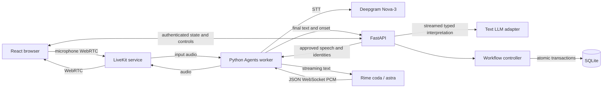

# PickMate architecture

## Ownership and paths

The API does not relay audio. The model proposes one typed operation; it never commits inventory and its prose never becomes an item/location instruction. The controller renders concise speech from validated state. The worker uses supported LiveKit `say`, interruption, VAD, STT, and playout APIs. The UI reads snapshots with increasing database event revision numbers, preventing an older network response from replacing newer state.

## State

Durable `Session` includes owner hash, room, pause flag, input identity, response epoch, active task, current speech, confirmation, worker identity/epoch and tool states. `PickTask` has task ID, task version, operation ID, exact item/quantity and lifecycle. SQLite stores events and unique input event IDs separately. Completed picks have unique operation ID and task ID, session ownership, item, quantity, confirmation ID and commit timestamp.

Task transitions: requested -> looking_up -> ready -> awaiting_confirmation -> committed. Cancellation moves uncommitted work to cancelled and increments its version. A new explicit find after a committed/cancelled task gets a new task/operation. A correction updates an uncommitted task and increments task_version. Status requests increment response_epoch but retain task_version, so current lookup results can be rendered in the current conversation.

## Interruption protocol

1. The worker immediately interrupts output at detected speech onset, retaining microphone capture. It sends ordered onset/turn controls to the API.
2. API onset sets resolving, interrupts current speech, invalidates any partial confirmation and clears the old input identity. It cancels pending model interpretation. An already-started transaction is allowed to finish; the order of SQLite transactions defines which operation won.
3. A meaningful final transcript gets a fresh response epoch and input identity. Typed interpretation must still match both before affecting state. Partial streamed arguments are never applied. Full transcripts and normalized operations are logged separately.
4. Semantic corrections increment task_version. Cancel old read-only work where supported. Every lookup callback checks session, task identity, version and lifecycle in the same transaction that accepts the result. Cancellation-ignoring late lookups are explicitly rejected.
5. A valid lookup may finish while paused or resolving. Its task can become ready, but its instruction is held. Status/false-interruption recovery re-renders current state through the current response epoch.
6. The worker checks current speech/task/epoch twice before scheduling, also checking pending input and current user-speaking state. It interrupts a handle when that response becomes obsolete. Speech completion retains the original handle's response identity. Supported plugin cancellation removes a cancelled WebSocket from the connection pool. Rime contextId is not a simultaneous-generation identity or cancellation proof.
7. False VAD interruption with no meaningful transcript preserves task identity and re-renders current state. A bounded silence fallback also handles noise during silent lookups. False-interruption rates and echo behavior require real acoustic testing.
8. On end, all future callbacks are fenced; completions remain durable. A new worker claims a generation, invalidating previous inputs/confirmations. Every mutating worker request rechecks its generation inside the SQLite transaction, in addition to HTTP room/key validation.

There is no custom browser audio gate that guesses audio identity from a text event. LiveKit owns playback buffer clearing. Audio already in the WebRTC/device buffers may remain briefly audible. Physical audible-stop latency is unverified until measured with a shared-clock recording; controller cancellation and SDK playout are insufficient evidence.

## Confirmation and commit boundary

`I picked them` creates a readback bound to task ID, version, SKU and quantity. Fixture completion requires playing then completed acknowledgements for that exact response before generic yes is enabled, with a 30-second expiry. Interrupted/currently unresolved output invalidates the binding. Live SDK completion is logged as untrusted and does not enable generic yes; a self-contained exact confirmation is required. Decimal punctuation cannot merge digits into another quantity.

Inside **one `BEGIN IMMEDIATE` transaction**: load latest session, validate input/worker generation and active task, check confirmation and quantities, recheck stock, compare-and-decrement inventory, insert unique completion, set task committed, and append commit events. `COMMIT` is the durable boundary. An asyncio cancellation is shielded until the transaction finishes; it cannot be described as rolling back a completed action. Duplicate confirmation returns the existing receipt. Changed stock rejects the operation without partial decrement. No undo/compensation or partial picks are exposed.

## Recovery and failure

Token requests explicitly create/check the room and named agent dispatch. Token-based room configuration alone cannot redispatch an agent into an already-existing room. A healthy pending/running dispatch is retained; a departed/failed dispatch is replaced. Concurrent retries preserve the first replacement for the same worker generation. The replacement worker reports connected before asking the controller to recover, avoiding a failed-provider speech gate deadlock. Worker leases fence retiring callbacks.

API restart recovery requires `/control recover` (UI reconnect) or worker claim/recover; transient confirmation delivery is invalidated, uncertain lookup state asks for another request, and committed receipts remain authoritative. All database I/O runs in worker threads; provider and lookup waiting do not block the audio event loop. The MVP requires one API process and a persistent local SQLite volume.

## Evidence boundaries

Generated text, speech queue/start/stop estimates, and actual committed writes are separate events. Events include UTC correlation time and a process-specific monotonic clock domain. Worker metrics retain their own timestamps in data; the API ingest timestamp is not substituted for provider timing. Aligned SDK assistant transcripts are logged as estimates. No code subtracts browser and server clocks for a latency claim. See `PROVIDERS.md` for exact installed SDK and transport decisions, and `LIVE_TESTS.md` for recording requirements.
